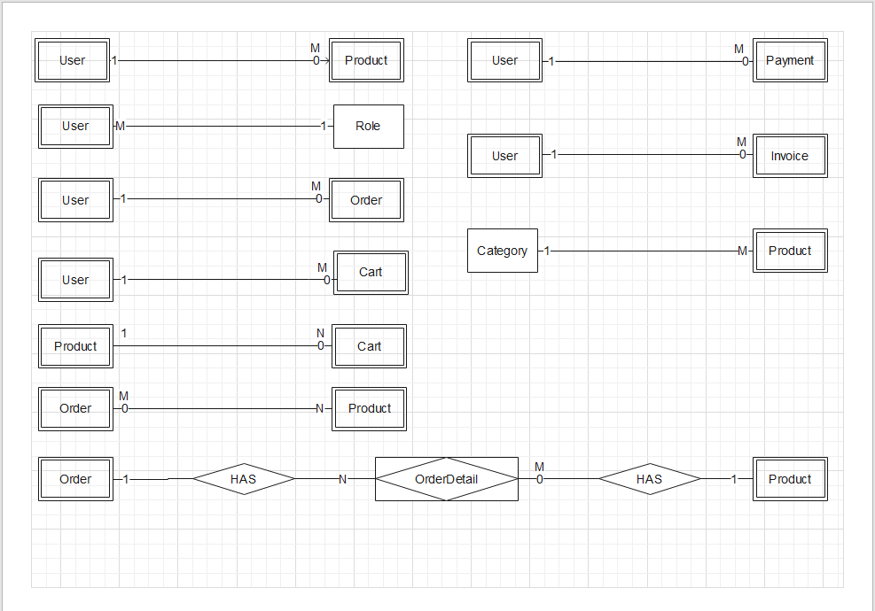
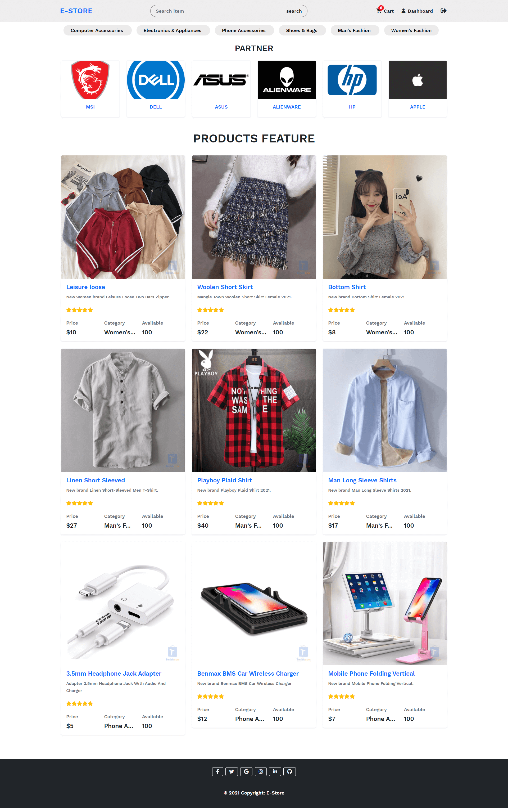
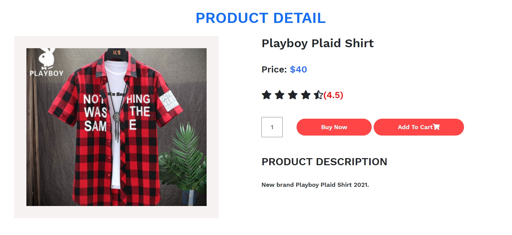
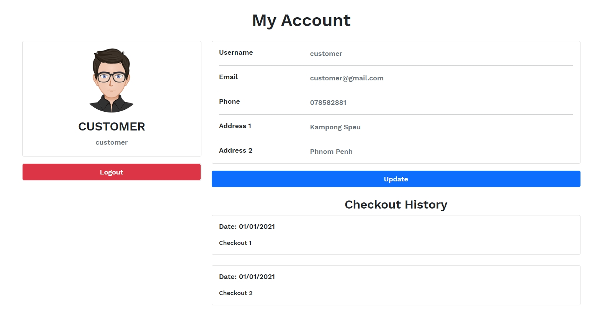

# E-Stroe

This project is for response to subject WAD's assignment under topic "E-Commerce Website".

## Required
- PHP
- Bootstrap
- Javascript
- MySQL

## Architectural pattern
- **MVC**: Let's understand this Model, View, Controller concept in detail:

### Model: Database operation such as fetch data or update data etc.
- The Model object knows all about all the data that need to be displayed.
- The Model represents the application data and business rules that govern to an update of data.
- Model is not aware about the presentation of data and How the data will be display to the browser.
### View: End-user GUI through which user can interact with system, i.e., HTML, CSS.
- The View represents the presentation of the application.
- View object refers to the model remains same if there are any modifications in the Business logic.
- In other words, we can say that it is the responsibility of view to maintain consistency in its presentation and the model changes.
### Controller: Contain Business logic and provide a link between model and view.
- Whenever the user sends a request for something, it always goes through Controller.
- A controller is responsible for intercepting the request from view and passes to the model for appropriate action.
- After the action has been taken on the data, the controller is responsible for directly passes the appropriate view to the user.
- In graphical user interfaces, controller and view work very closely together.

## Relationship Daigram


## Git clone commands:
```
git clone https://github.com/MrrHak/e-store.git
```

## You must Add config file to app/configs/config.php:
```php
<?php
  //TODO:Connect your own local database
  // Database
  define('DB_HOST', 'localhost');
  define('DB_PORT', '3306');
  define('DB_NAME', 'estore_db');
  define('DB_USER', 'root');
  define('DB_PASS', '');

  // APP ROOT
  define('APPROOT', dirname(dirname(__FILE__)));
  // URL ROOT
  //TODO:Your own local project root (e.g: http://localhost/web/e-store)
  define('URLROOT', 'http://localhost/web/e-store');
  // SITE NAME
  define('SITENAME', 'E-Store');
?>
```

## You must add file .htaccess at public/.htaccess with code below:
```php
<IfModule mod_rewrite.c>
  Options -Multiviews
  RewriteEngine On
  RewriteCond %{REQUEST_FILENAME} !-d
  RewriteCond %{REQUEST_FILENAME} !-f

  # For redirect to index page if file not exists
  # TODO put your own path below (e.g: http://localhost/web/e-store)
  RewriteBase /web/e-store/public
  RewriteRule ^(.+)$ index.php?url=$1 [QSA,L]
</IfModule>
```

## Starting Point

To get start

```php
public/index.php
```

## Admin Dashboard Login /dashboard
```txt
Username: admin
Password: 12345678
Email: admin@e-store.com
```

## Customer Login
```txt
Username: customer
Password: 12345678
Email: customer@gmail.com
```

## Live Preview
  ```
  http://mrrhak.com/e-store/
  ```

## Scope of projects

### Frontend Feature
- **[Home](#home)**
- **[Product Detail](#product-detail)**
- **[My Account](#my-account)**

### Backend Feature
- **[Dashboard](#dashboard)**

## Frontend UI
### Home


### Product Detail


### My Account


## Backend UI
### Dashboard
- Use AdminLte 3.1 rc Template for backend dashboard, link download template 
  
  ```
  https://github.com/ColorlibHQ/AdminLTE
  ```
 


## Contributor
1. [Long Kimhak](http://www.mrrhak.com)
2. [Tep Chiva](/#)
3. [Mai Veasna](/#)
4. [Ny Soknet](/#)
5. [Hoh Leakhena](/#)
6. [Sreng Sokkea](/#)

## Created At
03-03-2021

## License
GPL
